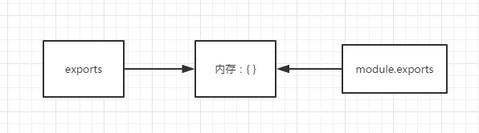

## HTML5离线存储

manifest文件是简单的文本文件，它告知浏览器被缓存的内容（以及不缓存的内容），支持manifest的浏览器，会将按照manifest文件的规则，将文件保存在本地，从而在没有网络链接的情况下，也能访问页面。

### html中使用方式
```
<html manifest="demo.appcache">

<body>
The content of the document......
</body>

</html>
```
### manifest文件的编写规范

```
CACHE MANIFEST
# 注释：需要缓存的文件，无论在线与否，均从缓存里读取
CACHE:
chched.js
cached.css

# 注释：不缓存的文件，无论缓存中存在与否，均从新获取
NETWORK:
uncached.js
uncached.css

# 注释：获取不到资源时的备选路径，如index.html访问失败，则返回404页面
FALLBACK:
index.html 404.html
```


## localstorge cookie sessionstorge 区别
  1.localstorge浏览器本地存储单页面关闭时也不会被销毁  
  2.sessionstorge只在页面会话期有效页面关闭时数据销毁  
  3.cookie关闭时也不会被销毁但是内容存储一般为4kb左右一般存用户的登录信息  

## 页面可见性Api
  当用户最小化窗口或切换到另一个选项卡时，API会发送visibilitychange事件，让听众知道页面状态已更改。你可以检测事件并执行某些操作或行为不同。例如，如果您的网络应用正在播放视频，则可以在用户将标签放入背景时暂停视频，并在用户返回标签时恢复播放。 用户不会在视频中丢失位置，视频的音轨不会干扰新前景选项卡中的音频，并且用户在此期间不会错过任何视频
## css优先级算法
  行内样式 > 嵌入样式表 > 外链样式表  
  ！important > id > class > tag  
  ！import权重最高  
## 请解释一下为什么需要清除浮动？清除浮动的方式
  清除浮动是为了清除使用浮动元素产生的影响。浮动的元素，高度会塌陷，而高度的塌陷使我们页面后面的布局不能正常显示。  
  1.clear:both  
  2.浮动元素的父级div定义伪类:after  

## [VUE.js的双向绑定原理](https://juejin.im/entry/5923973da22b9d005893805a)
  通过数据劫持结合发布者-订阅者模式的方式来实现的双向绑定  
  在getter中初始化需要被订阅的对象  
  在setter中如果数据变化，通知所有订阅者
  数据劫持Object.defineProperty()方法  
  Object.defineProperty(obj, prop, descriptor)：直接在一个对象上定义一个新属性，或者修改一个新属性，并返回这个对象  

  1.通过实现一个observer，实质是Object.defineProperty()方法设置get、set的来监听属性的变化，dep.notify()通知dep订阅器监听vue实例中的所有属性变化      

  2.消息订阅器Dep容器，订阅器Dep主要负责收集订阅者(收集被监听的对象)(ps：Dep=[watcher1,watcher2,watcher3.....]) 

  3.订阅者Watcher在初始化的时候需要将自己添加进订阅器Dep中（只要在订阅者Watcher初始化的时候才需要添加订阅者到dep中）   

  4.Compile编译解析Dom  
      1.解析模板指令，并替换模板数据，初始化视图
      2.将模板指令对应的节点绑定对应的更新函数，初始化相应的订阅器  

#### 双向绑定流程：
  ``` 
    compile编译解析DOM节点 遍历节点匹配v-model指令绑定更新函数（callback（）就是innerHTML）找到订阅者，
    --->然后watcher方法中向dep添加watcher
    compile-->初始化视图层
    首先Observer监听所有属性，当通过视图层（如：input改变绑定属性值）或模型层改变某个属性的时候，通知----->Dep(订阅器)  
    --->遍历Dep触发每个watcher(订阅者）的updatpe方法比较oldVal！== newVal 当不相等时说明这个属性已经改变了
    --->然后通过传入watcher的callback（dom.innerHTML）来渲染页面  
    
  ```
  

## get 与 post 的区别
  1.get:把参数包含在URL中。  
  2.post：参数通过request-body传递参数，没有参数长度限制  
  3.get请求参数有长度限制而post没有长度限制  
  4.参数类型:get请求只接受ASCII字符，而post没有限制  
  5.**GET请求只能进行url（encodeURIComponent）编码，而POST支持多种编码方式**

## Xss 与 Csrf 网络安全知识
  Xss:**跨站脚本攻击**,  脚本注入  
  >  原理:攻击者的输入没有经过后台的过滤直接进入到数据库，最终显示给来访的用户。  
  防御方法：避免 XSS 的方法之一主要是对**用户输入的内容进行过滤**  

  CSRF:**跨站请求伪造**
  >  原理:受害者登录受信任网站A，并在本地生成Cookie，然后在访问危险网站B。  
  防御：给每个表单加入随机 **Token**进行验证，这样B页面无法获取A页面的 Token 导致请求验证失败，从而防止了 CSRF。  

## [post 请求中 Content-Type](https://imququ.com/post/four-ways-to-post-data-in-http.html)    
  Content-Type 字段来获知请求中的消息主体是用何种方式编码，再对主体进行解析  
  > application/x-www-form-urlencoded 

  >application/json

  >text/xml

  >multipart/form-data  

## 请求状态码
  * 200 请求成功
  * 301 请求资源已被永久的移到了新URL
  * 302 请求资源临时转移到新URl
  * 304 请求的资源未修改
  * 401 请求要求用户身份认证
  * 403 服务器拒绝执行请求
  * 404 请求地址不存在
  * 500 服务器错误
  * 501 服务器不支持请求的功能

## 事件循环
  异步任务队列执行顺序是：先执行微任务，所有的微任务执行完在执行宏任务（宏任务微任务都属于异步事件）
  > 宏任务   
    1.setInterval  
    2.setTimeout  
    3.I/O  
    
  > 微任务  
    1.promise  
    2.process.nextTick

## [window.postMessage](https://developer.mozilla.org/zh-CN/docs/Web/API/Window/postMessage)
### 语法
  <font color="yellow">otherWindow.postMessage(message, targetOrigin, [transfer]);  </font>

  window.postMessage() 方法可以安全地实现跨源通信。  
  通常，对于两个不同页面的脚本，只有当执行它们的页面位于具有相同的协（通常为https），  
  端口号（443为https的默认值），以及主机  (两个页面的模数 Document.domain即域名设置为相同的值) 时  
  window.postMessage() 方法被调用时，会在所有页面脚本执行完毕之后（e.g., 在该方法之后设置的事件、之前设置的timeout 事件,etc.）向目标窗口派发一个  MessageEvent 消息。 该MessageEvent消息有四个属性需要注意  
  即：当执行完postMessage后，被接受数据的的窗口会执行Message事件
  * message 属性表示该message 的类型； 
  * data 属性为 window.postMessage 的第一个参数；
  * origin 属性表示调用window.postMessage() 方法时调用页面的当前状态； 
  * source 属性记录调用 window.postMessage() 方法的窗口信息。

### 例子
  ```
  /*
 * A窗口的域名是<http://example.com:8080>，以下是A窗口的script标签下的代码：
 */

var popup = window.open(...popup details...);

// 如果弹出框没有被阻止且加载完成

// 这行语句没有发送信息出去，即使假设当前页面没有改变location（因为targetOrigin设置不对）
popup.postMessage("The user is 'bob' and the password is 'secret'",
                  "https://secure.example.net");

// 假设当前页面没有改变location，这条语句会成功添加message到发送队列中去（targetOrigin设置对了）
popup.postMessage("hello there!", "http://example.org");

function receiveMessage(event)
{
  // 我们能相信信息的发送者吗?  (也许这个发送者和我们最初打开的不是同一个页面).
  if (event.origin !== "http://example.org")
    return;

  // event.source 是我们通过window.open打开的弹出页面 popup
  // event.data 是 popup发送给当前页面的消息 "hi there yourself!  the secret response is: rheeeeet!"
}
window.addEventListener("message", receiveMessage, false);

  ```
```
/*
 * 弹出页 popup 域名是<http://example.org>，以下是script标签中的代码:
 */

//当A页面postMessage被调用后，这个function被addEventListenner调用
function receiveMessage(event)
{
  // 我们能信任信息来源吗？
  if (event.origin !== "http://example.com:8080")
    return;

  // event.source 就当前弹出页的来源页面
  // event.data 是 "hello there!"

  // 假设你已经验证了所受到信息的origin (任何时候你都应该这样做), 一个很方便的方式就是把enent.source
  // 作为回信的对象，并且把event.origin作为targetOrigin
  event.source.postMessage("hi there yourself!  the secret response " +
                           "is: rheeeeet!",
                           event.origin);
}

window.addEventListener("message", receiveMessage, false);
```
## SEO原理
  ### 爬行和抓取
  > 搜索引擎派出一个能够在网上发现新网页并抓文件的程序，这个程序通常称之为蜘蛛（Spider）。搜索引擎从已知的数据库出发，就像正常用户的浏览器一样访问这些网页并抓取文件。搜索引擎通过这些爬虫去爬互联网上的外链，从这个网站爬到另一个网站，去跟踪网页中的链接，访问更多的网页，这个过程就叫爬行。这些新的网址会被存入数据库等待搜索。所以跟踪网页链接是搜索引擎蜘蛛（Spider）发现新网址的最基本的方法，所以反向链接成为搜索引擎优化的最基本因素之一。搜索引擎抓取的页面文件与用户浏览器得到的完全一样，抓取的文件存入数据库。  
  ### 建立索引
  > 蜘蛛抓取的页面文件分解、分析，并以巨大表格的形式存入数据库，这个过程即是索引（index).在索引数据库中，网页文字内容，关键词出现的位置、字体、颜色、加粗、斜体等相关信息都有相应记录。  
  ### 搜索词处理
  > 用户在搜索引擎界面输入关键词，单击“搜索”按钮后，搜索引擎程序即对搜索词进行处理，如中文特有的分词处理，去除停止词，判断是否需要启动整合搜索，判断是否有拼写错误或错别字等情况。搜索词的处理必须十分快速。
  ### 排序
  > 对搜索词处理后，搜索引擎程序便开始工作，从索引数据库中找出所有包含搜索词的网页，并且根据排名算法计算出哪些网页应该排在前面，然后按照一定格式返回到“搜索”页面。
  再好的搜索引擎也无法与人相比，这就是为什么网站要进行搜索引擎优化。没有SEO的帮助，搜索引擎常常并不能正确的返回最相关、最权威、最有用的信息。
  ### 防止SEO降权
  1. 添加优质外链  
  2. 页面结构清晰  
  3. 减少对主题标题的更改 
  4. 设置meta标签keyword等属性

## [common.js规范与es6模块的区别](https://segmentfault.com/a/1190000010426778)
  ### common.js规范 （node中使用多）
  1. module.exports 与 exports  
      exports = module.exports = {}  
      exports 和 module.exports在一个node执行一个文件时，会给这个文件内生成一个 exports和module对象，  
      而module又有一个exports属性。他们之间的关系如下图，都指向一块{}内存区域。 

      


      ```
        //exports实质是module.exports的引用所以在导出node模块不可以 exports='....' 这样就覆盖了引用
        let a = 100;

        console.log(module.exports); //能打印出结果为：{}
        console.log(exports); //能打印出结果为：{}

        exports.a = 200; //这里辛苦劳作帮 module.exports 的内容给改成 {a : 200}

        exports = '指向其他内存区'; //这里把exports的指向指走

        //test.js

        var a = require('/utils');
        console.log(a) // 打印为 {a : 200}  

      ```
> 其实require()引用的是module.exports的指向的内存块内容,而exports只是module.exports的引用，辅助后者添加内容用的。  

    用白话讲就是，exports只辅助module.exports操作内存中的数据，辛辛苦苦各种操作数据完，累得要死，结果到最后真正被require出去的内容还是module.exports的，真是好苦逼啊。


  ### ES6模块
  1. export 与 export.default 的区别
  ``` 
    //a.js
    var a = 1;
    function b (){...}
    export {a}
    export {b}
    export default a
    //b.js
    import { a , b } , x  from './a.js'
    console.log(a) //1
    console.log(b) //function....
    console.log(x) //1
  ```
  export 在文件中可以有多个，但是export.default（将模块按系统默认导出）只能有一个  
  export 可以直接导出表达式而export.default不可以（export var a=1）

  > 1.export与export default均可用于导出常量、函数、文件、模块等  
    2.在一个文件或模块中，export、import可以有多个，export default仅有一个  
    3.通过export方式导出，在导入时要加{ }，export default则不需要  
    4.export能直接导出变量表达式，export default不行。  

    ```
      'use strict'
      //导出变量
      export const a = '100';  

      //导出方法
      export const dogSay = function(){ 
          console.log('wang wang');
      }

      //导出方法第二种
      function catSay(){
        console.log('miao miao'); 
      }
      export { catSay };

      //export default导出
      const m = 100;
      export default m; 
      //export defult const m = 100;// 这里不能写这种格式。
    
    ```  
  ### [在webpack中存在使用require引用export defalut 或者export](https://juejin.im/post/5a2e5f0851882575d42f5609#comment)
  > 在 babel5 时代，大部分人在用 require 去引用 es6 输出的 default，只是把 default 输出看作是一个模块的默认输出,所以 babel5 对这个逻辑做了 hack，如果一个 es6 模块只有一个 default 输出，那么在转换成 commonjs 的时候也一起赋值给 module.exports，即整个导出对象被赋值了 default 所对应的值.  
  这样就不需要加 default，require('./a.js') 的值就是想要的 default值。

      ```
        //a.js
        var a = 1
        export defalut a
        // b.js
        require('./a.js').default;
      ```

  > 还有一个很重要的问题，一旦 a.js 文件里又添加了一个具名的输出，那么引入方就会出麻烦。  

    ```
      // a.js

      export default 123;

      export const a = 123; // 新增

      // b.js 

      var foo = require('./a.js');
      console.log(foo)
      // 由之前的 输出 123
      // 变成 { default: 123, a: 123 }

    ```
  > 所以 babel6 去掉了这个hack，这是个正确的决定，升级 babel6 后产生的不兼容问题 可以通过引入 [babel-plugin-add-module-exports](https://www.npmjs.com/package/babel-plugin-add-module-exports) 解决。
## bind的实现原理
  ```
    Function.prototype.mybind=funcion(context){
      let self = this 
      //获取到除了需要绑定的上下文以外的所有参数
      //let args = Array.prototype.slice.call(arguments,1)
      return function (){
        //额外参数执行bind后返回的方法传入参数
        let fnArgs = Array.prototype.slice.call(arguments)
        self.apply(context,fnArgs)
      }
    }
    function a(age){
      console.log(age)
      console.log(this.name)
    }
    var b={
      name:'sheyang'
    }
    a.mybind(b)('x')
  ```

  ```
  function Animal(a,b){
    console.log(a+b)
　　　this.species = "动物";
  }
  function Cat(name,color){
        console.log(arguments)
  　　　　Animal.apply(this, arguments);
  　　　　this.name = name;
  　　　　this.color = color;
        console.log(name)
        console.log(color)
  　　}
  　　var cat1 = new Cat("大毛","黄色");
    console.log(cat1)
  　　alert(cat1.species); // 动物
  //执行了两次apply 一次在构造函数继承的时候，将上下文绑定至cat作用域，第二次是new
  //时将上下文绑定至new中新的创建一个对象上


  ```
## 实现apply与call
  ```
    //1.apply思路：将要改变this指向的方法挂到目标this上执行并返回
    Function.prototype.myapply(context){
      if(typeof this! == 'function'){
        console.log('Not a function')
        return 
      }
      context = context || window
      context.fn = this
      let result
      //appy 传入的第二个参数为类数组所以arguments的length为2 第一个为上下文对象，第二个参数为传入///函数的参数
      if(arguments[1]){
        result = context.fn(...arguments[1])
      }else{
        result = context.fn()
      }
      delet context.fn
      return result
    }
    //2.call思路：将要改变this指向的方法挂到目标this上执行并返回
    Function.prototype.mycall(context){
      if(typeof this ! == 'function'){
        console.log('not a function ')
        return 
      }
      context = context || window
      context.fn = this
      let args = [...arguments].slice(1)
      let result = context.fn(...args)
      delete context.fn
      return result
    }


  ```
## 继承
  ```
    //1.构造函数继承
    //缺点：子类实例获取不到父类原型对象上的属性
    function superType(){
      this.a=[1,2,3,4]
    }
    superType.prototype.b = '我是父类原型上的属性'
    function child(x,y){
      superType.apply(this,arguments)
      this.x = x
      this.y = y
    }
    var c = new child ('sheyang','....')
    var d = new child ('hehe','....')
    c.a.push(5)
    console.log(c)//{a:[1,2,3,4,5],x:'sheyang',y:'....'}
    console.log(d)//{a:[1,2,3,4],x:'hehe',y:'....'}
    console.log(c.b)//undefined 

    // 2. 原型链继承
    //缺点:由于父类上的属性是共享，子类的实例修改父类上的引用类型属性时，会影响其他子类实例
    function superType(){
      this.a=[1,2,3,4]
    }
    superType.prototype.b = '我是父类原型上的属性'
    function child(x,y){
      this.x = x
      this.y = y
    }
    child.prototype = new superType()
    var c = new child ('sheyang','....')
    var d = new child ('hehe','....')
    c.a.push(5)
    console.log(c)//{a:[1,2,3,4,5],x:'sheyang',y:'....'}
    console.log(d)//{a:[1,2,3,4,5],x:'hehe',y:'....'}
    console.log(c.b)//我是父类原型上的属性 

    //组合继承
    //优点：解决了构造函数继承和原型链继承的缺点
    //缺点：父类构造函数被执行两次1次是在子类中的apply第二次是在child.prototype = new superType()
    //new中的也有apply。这样就会有子类的实例中已经存在了父类的属性，且子类的原型对象上也存在父类属性。
    //会导致内存浪费
    function superType(){ 
      this.a=[1,2,3,4]
    }
    superType.prototype.b = '我是父类原型上的属性'
    function child(x,y){
      superType.apply(this,arguments)
      this.x = x
      this.y = y
    }
    child.prototype = new superType()
    var c = new child ('sheyang','....')
    var d = new child ('hehe','....')
    c.a.push(5)
    console.log(c)//{a:[1,2,3,4,5],x:'sheyang',y:'....'}
    console.log(d)//{a:[1,2,3,4],x:'hehe',y:'....'}
    console.log(c.b)//我是父类原型上的属性 

    //寄生组合式继承
    //特点：在组合式继承的基础上减少一次父类构造函数的执行，解决内存浪费问题
    function superType(){ 
      this.a=[1,2,3,4]
    }
    superType.prototype.b = '我是父类原型上的属性'
    function child(x,y){
      superType.apply(this,arguments)
      this.x = x
      this.y = y
    }
    //由于这一部会将子类原型上的constructor重写,所以我们要修复这一个问题.
    child.prototype = superType.prototype
    child.prototype.constructor = child
    var c = new child ('sheyang','....')
    var d = new child ('hehe','....')
    c.a.push(5)
    console.log(c)//{a:[1,2,3,4,5],x:'sheyang',y:'....'}
    console.log(d)//{a:[1,2,3,4],x:'hehe',y:'....'}
    console.log(c.b)//我是父类原型上的属性 

    //原型式继承（es6:Object.create()）
    //缺点无法传递参数
    //对引用类型修改时，属性会被篡改
    function create(obj){
      var f = function(){}
      f.prototype = obj
      return new f()
      //new 操作符是实际原理
      //new f() = { 
      // 	var obj={} 
      // 	obj.__proto__ = f.prototype //建立原型链
      // 	var result = f.apply(obj,arguments)
      //	return result
      // }
    }
    var person = {
      name: "Nicholas",
      friends: ["Shelby", "Court", "Van"]
    };
    var anotherPerson = create(person);
    anotherPerson.name = "Greg";
    anotherPerson.friends.push("Rob");

    var yetAnotherPerson = create(person);
    yetAnotherPerson.name = "Linda";
    yetAnotherPerson.friends.push("Barbie");
    console.log(anotherPerson)
    console.log(yetAnotherPerson)

  ```
  ## es6 class 类
  ```
    class Point {
      constructor() {
        // ...
      }

      toString() {   //实例方法 挂载在原型对象上的是实例方法
        // ...
      }

      toValue() {  //实例方法
        // ...
      }
      static sayName(){  //静态方法

      }
    }

    // 等同于

    Point.prototype = {
      constructor() {},
      toString() {},
      toValue() {},
    };
    //构造函数的prototype属性，在 ES6 的“类”上面继续存在。事实上，类的所有方法都定义在类的prototype属性上面。
    point.prototype.constructor === point //true


    //this的指向
    class Logger（）{
      printName(name='haha'){
        this.print(`Hello${name}`)
      }
      print(text){
        console.log(text)
      }
    }
    const logger = new Logger()
    const {printName} = logger
    printName() // TypeError: Cannot read property 'print' of undefined
    //class类中的this默认指向实例对象。 如果静态方法包含this关键字，这个this指的是类，而不是实例。 
    // 但是当单独出来用的时候this指向运行环境
    //printName(name='haha'){
    //   `use strict`
    //    this.print(`Hello${name}`)
    //  }
    //
    //在用于class 用的严格模式所以this指向undefined 本应该指向window

    //单独时候时解决方法将this绑定到实例对象上
    //constructor(){
    //  this.printName = this.printName.bind(this)
    //}

    //或者使用箭头函数
  ```

  ## class 继承
    ```
    class ColorPoint extends Point {   //父类可以看做是原型对象
      constructor(x, y, color) {
        this.x = x //ReferenceError
        super(x, y); // 调用父类的constructor(x, y) super() === Point.prototype.constructor.call(this)。
        this.color = color;
      }

      toString() {
        return this.color + ' ' + super.toString(); // 调用父类的toString()
      }
    }
    //上面代码中，constructor方法和toString方法之中，都出现了super关键字，它在这里表示父类的构造函数，用来新建父类的this对象。
    //注意点
    // 1.子类中必须在constructor 中调用super方法  得到与父类同样的实例属性和方法，再加上子类自己的实例属性和方法。
    // 2.只有调用super之后，才可以使用this关键字，否则会报错 
    //3. super() 只能在子类的构造函数中用 A.  第二种情况，super作为对象时，在普通方法中，指向父类的原型对象；在静态方法中，指向父类。

    // 第一种情况super() 表示A.prototype.constructor.call(this)。 调用父类构造函数
    // 第二种情况，super作为对象时，在普通方法中，指向父类的原型对象；在静态方法中，指向父类。
    //super 表示指向父类的原型对象所以定义在父类实例上的方法或属性，是无法通过super调用的
    //super.print()虽然调用的是A.prototype.print()，但是A.prototype.print()内部的this指向子类B的实例，
    //Object.getPrototypeOf(child) === father// ture 方法可以用来判断一个类是否继承了另一个类。


    class A {
      constructor() {
        this.x = 1;
      }
      static print() {
        console.log(this.x);
      }
    }

    class B extends A {
      constructor() {
        super();
        this.x = 2;
      }
      static m() {
        super.print();
      }
    }

    B.x = 3;
    B.m() // 3

    //另外，在子类的静态方法中通过super调用父类的方法时，方法内部的this指向当前的子类，而不是子类的实例
    //在子类的静态方法中调用super对象指向的是父类，普通方法中指向的父类的原型对象

    ```

  ##  从输入 URL 到页面展示 这过程发生了什么  

  1. 判断输入内容是搜索内容，还是请求的 URL。  

  2. 查找缓存查找DNS缓存找出对应的ip地址然后建立tcp链接

  3. 渲染进程开始渲染html

  ## 浏览器渲染（重排、重绘、合成）
  ## 如何系统的优化性能 
  ### 加载阶段 
  1. 优化原则就是减少关键资源个数  （关键资源：js、html、css）
  2. 降低关键资源大小，  
  3. 降低关键资源的 RTT 次数 （RTT 就是这里的往返时延。它是网络中一个重要的性能指标，表示从发送端发送数据开始，到发送端收到来自接收端的确认，总共经历的时延）  

    预解析线程会快速扫描 HTML 数据中的关键资源，一旦扫描到了，会立马发起请求，JavaScript 和 CSS 是同时发起请求的，所以它们的请求是重叠的，那么计算它们的 RTT 时，只需要计算体积最大的那个数据就可以了。

  ### 交互阶段
  1. 减少 JavaScript 脚本执行时间
  2. 避免强制同步布局 （强制同步布局：JavaScript 强制将计算样式和布局操作提前到当前的任务中，JavaScript 还需要强制让渲染引擎默认执行一次布局操作。我们把这个操作称为强制同步布局。比如计算高度）
  3. 避免布局抖动 （在一段js中，反复执行布局操作就是布局抖动） 
  4. 合理利用 CSS 合成动画
  5. 避免频繁的垃圾回收

  ## 刷新页面，JS 请求一般会有哪些地方有缓存处理？
  1. DNS缓存
  2. cdn缓存
  3. 浏览器缓存
  4. 服务器缓存

  ## 一次完整的 HTTP 事务是怎么一个过程
  1. 建立连接的三次握手   
    1. 客户端发起建立连接请求。  
    2. 服务端回复，收到，统一建立连接。  
    3. 客户端回复收到服务端的回复   
  2. 断开连接的四次挥手  
    1. 客户端发起断开连接请求  
    2. 服务端回复收到  
    3. 服务端发起断开连接请求  
    4. 客户端回复收到  

  ## css有几种加载方式
    1. link标签引入
    2. @import 导入样式
    3. 行内样式
    4. 内嵌样式
  ## 页面导入时，使用 link 和 @import 有什么区别？
    1. link 是html标签 不仅仅可以引入css文件，@import 是css引入的语法
    2. link 是页面在加载时同时加载，@import 等页面被加载完成时在加载css
  ## src与href 的区别
    src：代表资源、一般是用于下载文件  
    href：表示与远程连接建立锚点，一般用于连接跳转  

  ## BFC是什么？如何形成BFC，有什么作用?
  1. BFC块级格式化上下文
  ### 如何形成
  1. 根元素  
  2. float属性不为none  
  3. position为absolute或fixed  
  4. display为inline-block, table-cell, table-caption, flex, inline-flex  
  5. overflow不为visible
  ### 有什么作用
  1. 清楚浮动
  2. 避免垂直外边距叠加
  

  ## 函数声明提升
  1. 只有函数声明格式的函数才会存在函数声明提前，比如函数表达式，构造函数，都不存在函数声明提前。  
    函数创建的三种写法：  
    a.函数声明：function fun(a){console.log(a)};(只有这个家伙存在函数声明提前)

    b.函数表达式：var fun = function(a){console.log(a)};

    c.构造函数：var fun = new Function("a",console.log(a));
  

 ## 闭包
  闭包就是由函数创造的一个词法作用域，里面创建的变量被引用后，可以在这个词法环境之外自由使用。
  闭包通常用来创建内部变量，使得这些变量不能被外部随意修改，同时又可以通过指定的函数接口来操作。

